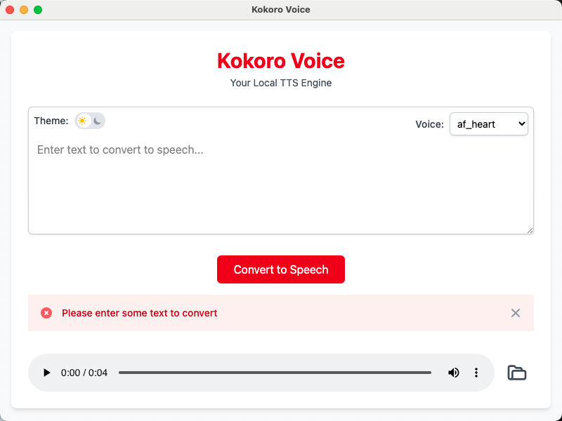

# KokoroVoice

A lightweight, local Text-to-Speech (TTS) engine powered by Kokoro TTS. Convert your text to natural-sounding speech effortlessly—completely free and without the hassle of token limits or subscription worries.

## Features
- **Local TTS Engine**: Runs entirely on your machine—no internet required.
- **Powered by Kokoro TTS**: Leverages the capabilities of Kokoro TTS for high-quality voice synthesis.
- **Free to Use**: No token consumption, no hidden costs, just pure TTS goodness.
- **Simple and Intuitive**: Translate your text to speech with ease.

## Screenshots
| Dark Mode | Light Mode |
|-----------|------------|
|  |  |

## Getting Started
### Prerequisites
- No python needed
- Kokoro TTS installed (if it’s a separate requirement).

### Installation
Download the latest release from the [Releases] page.
